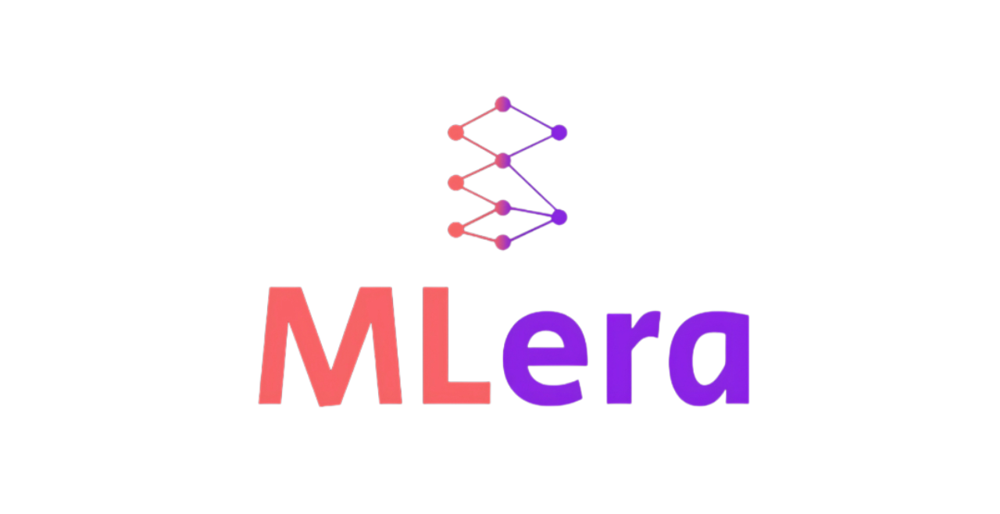

<p align="center">
  
</p>

<h1 align="center">MLera — Landing Page</h1>

<p align="center">
  <strong>Making Machine Learning intuitive, structured, and beginner-friendly.</strong>
</p>

<p align="center">
  <a href="https://nextjs.org"></a>
  <a href="https://react.dev"></a>
  <a href="https://tailwindcss.com"></a>
  <a href="https://vercel.com"></a>
</p>

---

## 📌 About

**MLera** is a Machine Learning education platform developed under **IIIT Dharwad Research Park**. It replaces chaotic YouTube playlists and jargon-heavy textbooks with a structured, story-driven, interactive learning experience.

This repository contains the **landing page** for MLera, built with Next.js App Router and Tailwind CSS.

### Core Philosophy

| Principle | Description |
|---|---|
| 📖 **Story-Based Learning** | Real-world scenarios first — learn *why* before *how* |
| 🔬 **Interactive Model Building** | Watch ML models train step-by-step with live visualizations |
| 💬 **Plain-Language Explanations** | Every term: simple definition + analogy + real-world example |
| 🤖 **AI Buddy** | Personal AI mentor for conversational Q&A, code examples, and breakdowns |
| 🧠 **AI-Powered Quizzes** | Dynamically generated, difficulty-adjustable assessments |

---

## 🖼️ Page Sections

| # | Section | Component | Description |
|---|---|---|---|
| 1 | **Navbar** | `Navbar.jsx` | Fixed navigation with MLera logo, section links, mobile hamburger menu |
| 2 | **Hero** | `Hero.jsx` | Full-screen hero with gradient, CTAs, and realistic platform preview mockup |
| 3 | **Problem** | `Problem.jsx` | 3 cards highlighting problems with traditional ML learning |
| 4 | **About** | `About.jsx` | Neural network SVG visualization + about MLera & IIIT Dharwad |
| 5 | **Features** | `Features.jsx` | 4 feature cards — Structured Paths, Interactive Learning, ML Lexicon, Roadmap |
| 6 | **Story Learning** | `StoryLearning.jsx` | 3 real-world scenario cards (Concrete Engineer, Medical Detector, House Price Guru) |
| 7 | **Interactive Learning** | `InteractiveLearning.jsx` | Tabbed SVG visualizations (scatter data, best-fit line, loss curve) with animated counters |
| 8 | **AI Buddy** | `AIBuddy.jsx` | Full chat UI mockup showcasing AI mentor with code, analogies, and explanations |
| 9 | **How It Works** | `HowItWorks.jsx` | 4-step learning journey with connecting line on desktop |
| 10 | **Why Different** | `WhyDifferent.jsx` | Side-by-side comparison: Traditional Platforms vs MLera |
| 11 | **Testimonials** | `Testimonials.jsx` | 6 learner testimonial cards from diverse backgrounds |
| 12 | **CTA** | `CTA.jsx` | Gradient call-to-action banner with MLera logo |
| 13 | **Footer** | `Footer.jsx` | Multi-column footer with Product, Company, Resources, Legal links |

---

## 🛠️ Tech Stack

- **Framework:** [Next.js 16](https://nextjs.org) (App Router + Turbopack)
- **UI Library:** [React 19](https://react.dev)
- **Styling:** [Tailwind CSS 4](https://tailwindcss.com) — utility-first, no external UI component libraries
- **Animations:** Custom CSS keyframes (`fade-in-up`, `float`, `slide-in-left/right`) + `IntersectionObserver`-based scroll reveals
- **Fonts:** [Geist](https://vercel.com/font) + Geist Mono via `next/font/google`
- **Images:** Next.js `<Image>` component for optimized rendering
- **Deployment:** Vercel (recommended)

---

## 🚀 Getting Started

### Prerequisites

- **Node.js** ≥ 18.x
- **npm** ≥ 9.x

### Installation

```bash
# Clone the repository
git clone https://github.com/yogeeshsm/MLera_Assignment.git
cd MLera_Assignment

# Install dependencies
npm install
```

### Development Server

```bash
npm run dev
```

Open [http://localhost:3000](http://localhost:3000) in your browser. The page auto-updates as you edit files.

### Production Build

```bash
npm run build
npm start
```

### Lint

```bash
npm run lint
```

---

## 📁 Project Structure

```
mlera-landing/
├── public/
│   ├── logo-dark.png              # MLera logo (dark background variant)
│   └── logo-light.png             # MLera logo (transparent background)
├── src/
│   ├── app/
│   │   ├── globals.css            # Tailwind imports + custom keyframe animations
│   │   ├── layout.js              # Root layout with fonts & metadata
│   │   ├── page.js                # Main page assembling all 13 sections
│   │   └── favicon.ico
│   └── components/
│       ├── SectionReveal.jsx      # Reusable IntersectionObserver scroll animation wrapper
│       ├── Navbar.jsx             # Fixed top navigation bar with mobile menu
│       ├── Hero.jsx               # Hero section with animated platform preview
│       ├── Problem.jsx            # Problem statement cards
│       ├── About.jsx              # About MLera + animated neural network SVG
│       ├── Features.jsx           # 4 platform feature cards with hover effects
│       ├── StoryLearning.jsx      # Story-based learning scenario cards
│       ├── InteractiveLearning.jsx # Interactive viz demo + animated counters
│       ├── AIBuddy.jsx            # AI Buddy chat UI showcase
│       ├── HowItWorks.jsx         # 4-step journey with desktop connecting line
│       ├── WhyDifferent.jsx       # Traditional vs MLera comparison
│       ├── Testimonials.jsx       # Learner testimonial cards
│       ├── CTA.jsx                # Call to action banner
│       └── Footer.jsx             # Multi-column site footer
├── package.json
├── next.config.mjs
├── postcss.config.mjs
├── eslint.config.mjs
└── jsconfig.json
```

---

## ✨ Key Features

| Feature | Details |
|---|---|
| 📱 **Fully Responsive** | Mobile-first design with `sm`, `md`, `lg` breakpoints across all components |
| 🎬 **Smooth Animations** | CSS-only animations with IntersectionObserver scroll triggers — no heavy JS libraries |
| 🧠 **Animated Neural Network** | SVG visualization with animated data pulses flowing through network layers |
| 📊 **Interactive Viz Tabs** | Live scatter plots, best-fit line evolution, and loss curve animations |
| 💬 **Chat UI Mockup** | Realistic AI Buddy conversation with code blocks, analogy cards, and explanations |
| 🔢 **Animated Counters** | Numbers count up on scroll (26+ modules, 200+ terms, 50+ visualizations) |
| 🔍 **SEO Optimized** | Proper metadata, semantic HTML, optimized images via `next/image` |
| ⚡ **Zero External Dependencies** | No Framer Motion, GSAP, or UI kits — pure Tailwind CSS + custom CSS |

---

## 🌐 Deployment on Vercel

This project is optimized for [Vercel](https://vercel.com):

1. Push code to GitHub ✅
2. Go to [vercel.com/new](https://vercel.com/new)
3. Import the **MLera_Assignment** repository
4. Click **Deploy** — Vercel auto-detects Next.js
5. Get your live URL 🎉

Every subsequent `git push` triggers automatic re-deployment.

---

## 👨‍💻 Author

**Yogeesh S M**
- GitHub: [@yogeeshsm](https://github.com/yogeeshsm)

---

## 🏛️ Acknowledgements

- **IIIT Dharwad** — Indian Institute of Information Technology, Dharwad
- **IIIT Dharwad Research Park (IDRP)** — Research and innovation hub
- Built with [Next.js](https://nextjs.org) and [Tailwind CSS](https://tailwindcss.com)

---

## 📄 License

This project is developed under **IIIT Dharwad Research Park**. All rights reserved.

---

<p align="center">
  Built with ❤️ in Dharwad, India
</p>
